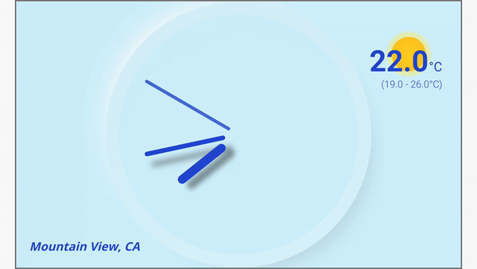

# Flutter Clock

Flutter Clock created for flutter clock challenge.

See [flutter.dev/clock](https://flutter.dev/clock) for how to get started, submission requirements, contest rules, and FAQs.

Example [Analog Clock](analog_clock)

Updated [Analog Clock](analog_clock)

